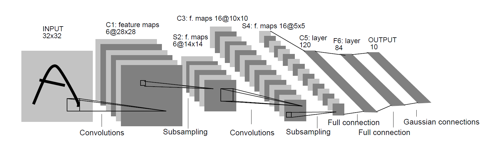
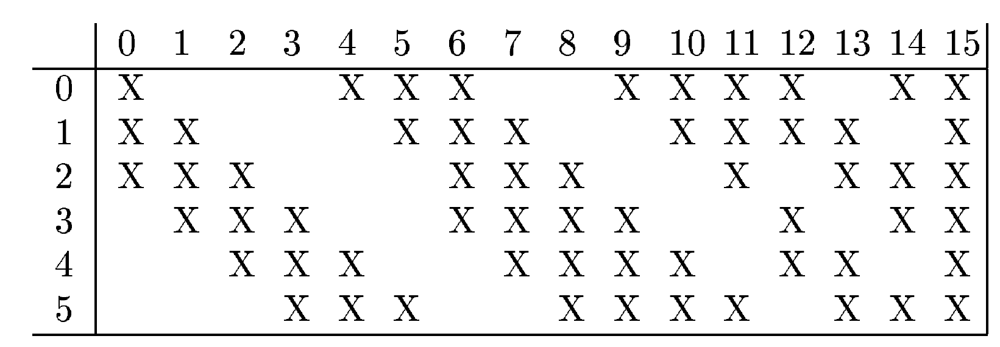

# LeNet5_keras_custom
A practice after reading this paper.

论文名《Gradient Based Learning Applied to Document Recognition》

## 网络结构
​	

LeNet-5一共6个层，不包括输入和输出。

* Input, 输入的shape是32x32.
* C1, 6个feature map，shape为28x28；使用卷积操作，大小为5x5.
* S2, 6个feature map，shape为14x14；使用池化操作，大小为2x2，步长为2.
* C3, 16个feature map，shape为10x10；使用卷积操作，大小为5x5.
* S4, 16个feature map，shape为5x5；使用池化操作，大小为2x2，步长为2.
* C5, 120个feature map，shape为1x1；使用卷积操作，大小为5x5.
* F6, 全连接层，84个unit.
* Output, 10个unit (根据输出类别而定).

### 注意
* 结构中的池化操作在论文中均使用的**average pool**, 实际上max pool的效果更好。

* 在S2→C3的卷积操作中，并不是对所有feature map进行卷积，而是经过一定的编码。

  

  前6个卷积核按照顺序分别卷积3层feature map，中间6个卷积核按照顺序分别卷积4层卷积核，之后3                                                      个卷积核跳过1层分别卷积4层卷积核，最后1个卷积核对全部feature map进行卷积。
  这样做的好处是可以消除对称性，有利于提取多种特征组合；并且可以有效的减少训练参数。前者是2416个参数，修改后是1516个参数。

* C5之所以不算全连接层，是因为经过卷积操作，当input的shape大于32x32，则c5层并不会是一个1x1的shape。

* **激活函数采用的是tanh**。

## Radial Basis Function unit
LeNet5的输出计算是通过RBF单元来进行计算。
网络将结果表示为一个7x12的编码，所以F6层有84个unit。在编码中，-1表示白色，1表示黑色，一个图片则有一个唯一的序列。
* output表示为RBF的输出，即预测编码与真实编码的欧氏距离。

  

## Loss Function
这样一个简单的输出可以采用MSE进行度量:

更好的方式是加上由"Rubbish" class带来的误差惩罚:

即计算RBF与非正确分类的距离。
后项比前项充分小，充当一个“竞争”的角色。

## 训练误差和测试误差的gap
LeNet提到了训练误差和测试误差的gap:

* P是训练样本的数量，当训练样本的数量越高，gap越小。
* h是系统的效率能力 (Effective capacity)。
* α是0.5~1.0的实数。
* k是常系数。
